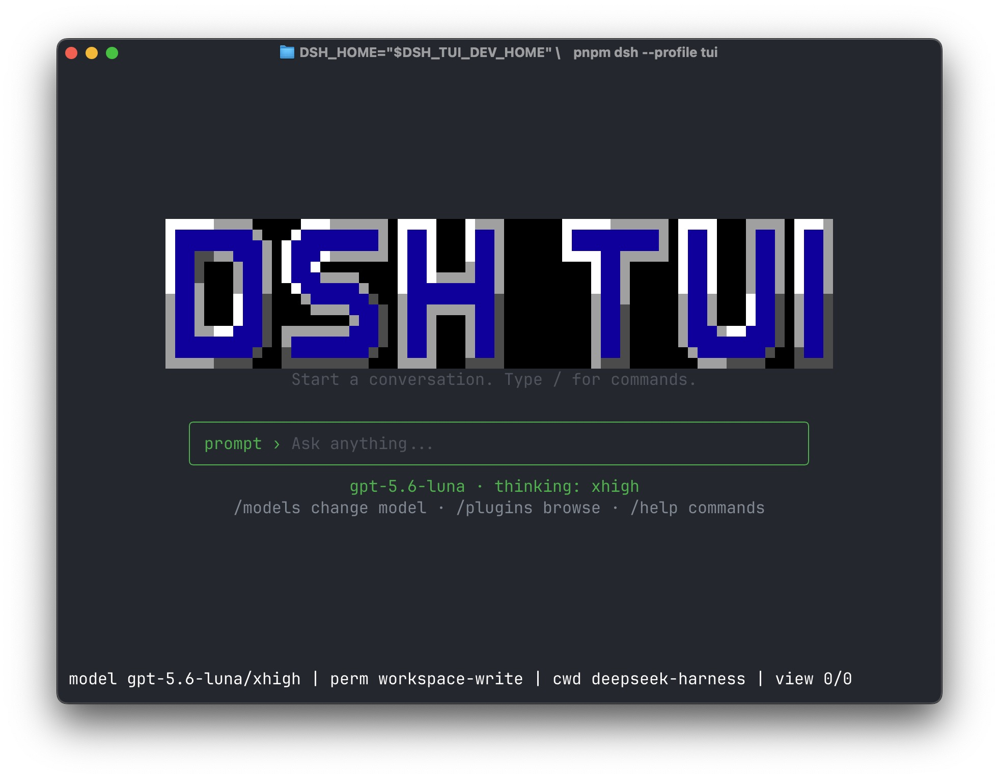
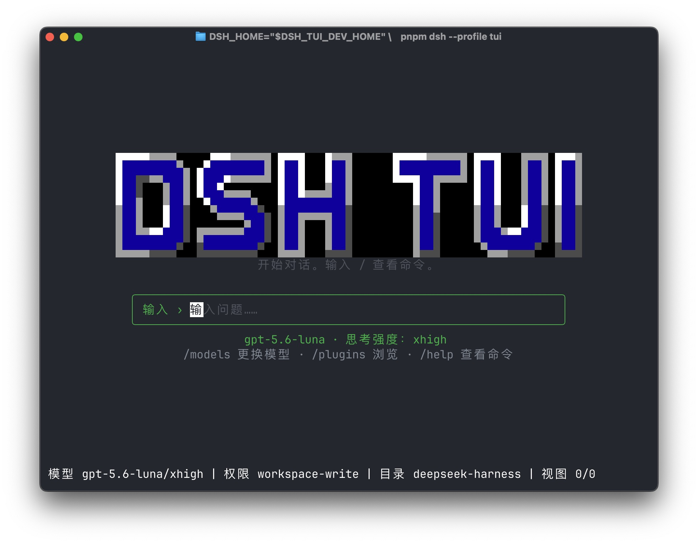

# DSH TUI

[](https://www.npmjs.com/package/@lingxi-ai-cn/dsh-tui)
[](https://github.com/Lingxi-AI-cn/dsh-tui-plugin/actions/workflows/ci.yml)
[](LICENSE)

[中文说明](README.zh.md)

**A native, post-install terminal interface for the official DeepSeek Harness.**

DSH TUI brings a focused, full-screen coding-agent experience to the terminal without replacing or forking the official Harness installation. Install it into a dedicated DSH profile, keep the upstream Agent loop and durable Session model, and gain a readable conversation surface, mouse-assisted navigation, Session workflows, runtime diagnostics, and Plugin Hub discovery.

> This is an independent community plugin. It runs inside the DeepSeek Harness Host process and follows the official Harness plugin and profile model.

## Preview

| English | 中文 |
| --- | --- |
| [](screenshots/screenshot_en.jpg) | [](screenshots/screenshot_cn.jpg) |

## Highlights

### Native conversation experience

- Full-screen terminal workspace with a compact live transcript, centered startup screen, model status, permission state, workspace, context pressure, and transcript position.
- Structured rendering for Markdown, reasoning, tool calls and results, diffs, searches, web activity, compaction, delegated Agents, and durable Tasks.
- Physical-row virtualization and Unicode-width layout keep long Sessions responsive and readable on narrow terminals.

### Session-centered workflows

- Resume persisted work with `/resume`, start clean with `/new` or `/clear`, and branch safely from an earlier completed human turn with `/rewind`.
- Browse and search the complete durable transcript, inspect full block details, move between the root and live child Agents, and monitor cancellable background work.
- Export a Session for review or backup with `/export`; prompts, tool activity, and workspace paths remain explicit diagnostic data.

### Four real Agent execution modes

- `/mode` selects the official Standard, PTC, Minimal, and Creator Agent Presets, plus healthy user presets already installed under `$DSH_HOME/.agent-presets`.
- Standard provides the full native coding toolset; PTC presents those capabilities through the TypeScript Code Mode SDK and `run_code`; Minimal keeps the official fixed prompt and exactly two tools; Creator adds runtime inspection and preset-authoring guidance.
- A blank Session switches atomically in place. After work has started, the same action creates a new confirmed Session so history is never replayed under a different tool catalog.
- Preset identity is durable: `/resume`, `/new`, `/clear`, and `/rewind` preserve it, and compatible Sessions move between Web and TUI without changing their composition.

### Fast keyboard and mouse interaction

- Command and path completion, submitted-prompt history, full-transcript search, draft stash, undo/redo, multiline editing, external editor integration, and bounded clipboard operations.
- Workspace-rooted `@` completion remains available on the exact official rc.8 Host through bounded Host filesystem traversal; it never expands into an unrestricted machine-wide search.
- Negotiated mouse support for transcript scrolling and common selectable UI targets, while `/config` can return selection and scrolling to the outer terminal.
- One configurable interaction registry powers runtime keybindings and the built-in `/help` panel, so available gestures stay discoverable.
- Capability-oriented `/commands`, `/skills`, `/mcp`, `/tips`, `/provider`, `/update`, and `/btw` views make installed functionality, provider setup, compatible updates, and lightweight side questions directly discoverable.

### Models, permissions, and human decisions

- `/models` discovers configured providers and models, supports provider-owned authentication flows, and selects the exact reasoning effort when available.
- The bundled OpenAI Codex adapter offers **Sign in with ChatGPT**, stores refreshable OAuth credentials under `$DSH_HOME/oauth/openai-codex.json`, and discovers the signed-in account's current model catalog dynamically.
- Image prompts use the Host-owned durable attachment service, so dropped screenshots remain available to the Codex request without embedding private filesystem paths in provider state.
- Approval requests and structured user questions are presented as bounded native dialogs instead of leaking into ordinary transcript state, and their input remains isolated from steer/follow-up delivery while an Agent is running.
- The actionable footer opens mode, model, permission, work, context, workspace, and transcript details without leaving the current Session.

### Bilingual and terminal-aware

- Switch the first-party interface at runtime with `/lang en` or `/lang zh`; menus, hints, dialogs, official rc.8 command descriptions, Plugin Hub chrome, and footer details follow the selected language.
- Automatic, dark, light, and no-color themes preserve semantic status even on limited-color terminals.
- Unicode display-width layout, a real IME cursor anchor, bounded terminal capability negotiation, and idempotent teardown protect CJK input and restore terminal state on exit.

### Plugin Hub and diagnostics

- `/plugins` separates installed-profile truth, Registry entries, and browse-only GitHub repositories; filters can distinguish all Registry entries from installable versions, while repository details expose scan and publication status before opening GitHub.
- Profile changes remain on the official `dsh plugin` path; the TUI shows exact install or removal commands rather than creating a second package-management authority.
- `/doctor` reports Host/TUI capabilities and `/context` shows the loaded model, permission, tools, skills, and prompt contributors.

## Command overview

| Command | Purpose |
| --- | --- |
| `/mode` | Choose Standard, PTC, Minimal, Creator, or an installed user preset |
| `/models` | Choose a provider, model, and reasoning effort |
| `/config` | Configure theme, mouse ownership, and keybindings |
| `/lang en\|zh` | Switch the TUI language |
| `/resume` | Search and resume a persisted Session |
| `/new`, `/clear` | Start a fresh Session in the current workspace |
| `/rewind` | Create a child Session from an earlier safe turn |
| `/export` | Export durable Session data |
| `/plugins` | Browse discoverable and installed plugins |
| `/doctor` | Inspect runtime health and capabilities |
| `/context` | Inspect loaded context facts |
| `/help` | List commands and effective interaction bindings |
| `/commands`, `/skills`, `/mcp`, `/tips` | Inspect available commands, skills, MCP tools, and interaction guidance |
| `/provider`, `/update` | Inspect provider setup and check for a compatible TUI release |
| `/btw` | Ask one bounded tool-free side question without replacing the active Session |
| `/quit`, `/exit` | Restore the terminal and exit safely |

## Compatibility

The current public TUI release is deliberately pinned to the matching official Harness release.

| DSH TUI | DeepSeek Harness | Node.js | Platforms |
| --- | --- | --- | --- |
| `0.1.4-rc.8` | exactly `0.1.0-rc.8` | `^22.19.0` or `>=24` | macOS 14 and Ubuntu 24.04 CI |

Support for a newer Harness version is added only after exact-package clean-room installation, profile composition, PTY startup/exit, and terminal-restoration verification.

The TUI core version advances independently (`0.1.4` here), while the final prerelease suffix (`rc.8`) always names the compatible official Harness prerelease. This avoids presenting a TUI iteration as if it were a newer upstream DSH release.

## Install

Install the exact supported official Harness, then add DSH TUI to a dedicated `tui` profile:

```sh
npm install --global @deepseek-ai/dsh@0.1.0-rc.8
dsh plugin --profile tui add --save-exact @lingxi-ai-cn/dsh-tui@0.1.4-rc.8
dsh --profile tui
```

For a project-local Harness installation, run the same profile command through that installation's `dsh` binary.

On first launch:

```text
/models      choose or authenticate a model provider
/mode        choose the Agent execution mode
/lang zh     switch to Chinese
/config      choose theme, mouse behavior, and keybindings
/help        review commands and active shortcuts
```

### Existing or legacy `tui` profiles

The canonical profile contains exactly `@deepseek-ai/dsh-base` followed by `@lingxi-ai-cn/dsh-tui`. If an older profile still includes `@deepseek-ai/dsh-tui-app`, preserve it as a backup and let official DSH create a clean profile:

```sh
export DSH_HOME="${DSH_HOME:-$HOME/.dsh}"
mv "$DSH_HOME/profiles/tui" "$DSH_HOME/profiles/tui.before-lingxi"
dsh plugin --profile tui add --save-exact @lingxi-ai-cn/dsh-tui@0.1.4-rc.8
```

Sessions and credentials live outside the profile directory. Reapply only reviewed custom patches; do not copy the old profile back wholesale.

<details>
<summary>Installation notes</summary>

- Published TUI manifests mark the exact official Host peers optional for package-manager resolution because DSH supplies them outside the profile. A normal plugin install should not report those peers as missing or copy them into the profile; startup still validates the exact Host graph.
- Install only the user-facing `@lingxi-ai-cn/dsh-tui` package. It installs the six exact-version internal packages, including the Codex adapter; do not add them to the profile individually.
- Installation does not start OAuth or modify existing provider credentials. Choose **Sign in with ChatGPT** through `/models` when you want to connect an account.
- npm may ask whether to allow install scripts for official DSH native helpers. Follow npm's printed guidance for the official installation; do not add those packages to the TUI profile.

</details>

## Upgrade or reinstall

Install the exact TUI version that declares compatibility with the installed official Harness version:

```sh
dsh plugin --profile tui add --save-exact @lingxi-ai-cn/dsh-tui@0.1.4-rc.8
```

Release tags and npm versions are immutable. Do not mix package versions from different release candidates.

## Uninstall

Remove the user-facing bundle through the official plugin command:

```sh
dsh plugin --profile tui remove @lingxi-ai-cn/dsh-tui
```

Uninstalling the bundle does not delete Harness Sessions, credentials, or user-authored profile patches.

## Build from source

```sh
corepack enable
pnpm install --frozen-lockfile
pnpm run verify
pnpm run verify:clean-room
```

The verification pipeline checks public-source hygiene, tests, build output, the exact seven-package tarball closure, official-DSH clean-room composition, the Codex sign-in row, PTY startup and `/quit`, and terminal restoration. See [CONTRIBUTING.md](CONTRIBUTING.md) and [AGENTS.md](AGENTS.md) before changing package behavior.

## Security

DSH plugins execute inside the Harness Host process with the user's OS permissions; they are not a sandbox. Install only trusted versions and review profile changes. Session exports may contain prompts, tool arguments and results, and workspace paths. See [SECURITY.md](SECURITY.md) for vulnerability reporting.

## License

MIT

## Acknowledgements

DSH TUI is built on the architecture, plugin system, Agent runtime, and durable Session model of [DeepSeek Harness](https://github.com/deepseek-ai/deepseek-harness). Our thanks to [DeepSeek](https://www.deepseek.com/) and the DeepSeek Harness contributors for making the upstream project available to the community.
